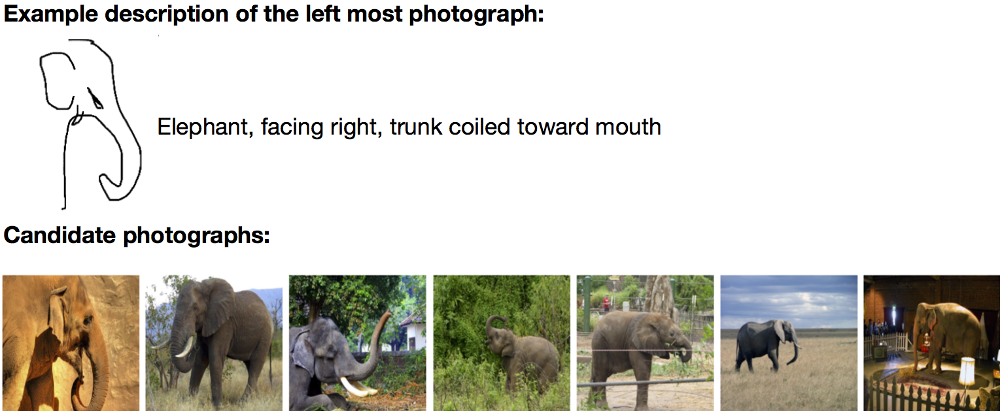

## The Data
This corpus pairs each real-life photograph with a natural language description (in English) and around 5 hand-drawn sketches. The photographs were sampled from the [ImageNet](http://www.image-net.org/) database. Each object description is composed of an object category label and descriptions of object attributes, collected using the Crowdflower service.  The hand-drawn sketches were selected from an existing corpus -- the [Sketchy dataset](http://sketchy.eye.gatech.edu/) which contains 125,000 sketches collected using Amazon MTurk. As the sketches and the natural langugae description complement each other, the corpus makes it possible to investigate the interplay between iconic (sketch) and symbolic (language) semantics.

## Resource details
The corpus includes:

- 10, 805 real-life photographs, selected from [ImageNet](www.image-net.org) which are paired with hand-drawn sketches in the [Sketchy dataset](http://sketchy.eye.gatech.edu/) .
-  10, 805 natural language descriptions of the objects in the photographs, collected from English speakers using the Crowdflower service.
-  hand-drawn sketches of each photograph, selected from the [Sketchy dataset](http://sketchy.eye.gatech.edu/), stored as SVG files.

 

Sample description of an elephant with words and sketches 

## Download
The natural language descriptions are available [here](https://pub.uni-bielefeld.de/data/2913193).  The *Sketchy data set* can be downloaded [here](http://sketchy.eye.gatech.edu/).

This [Github repository](https://github.com/TINGH/multimodal-object-description) contains an instruction of how to use the data and realted code for an image retrieving task.

When using the data in published research, please consider citing: T. Han and D. Schlangen, Draw and Tell: a Corpus of Multimodal Object Descriptions. Bielefeld University, 2017. doi:10.4119/unibi/2913193. [bib](https://pub.uni-bielefeld.de/data/2913193)

## Related publications
1.  **Draw and Tell: Multimodal Descriptions Outperform Verbal- or Sketch-Only Descriptions in an Image Retrieving Task**    **Ting Han** and David Schlangen. *Inproceedings of  the 8th international joint conference of natural language processing (IJCNLP), Taipei, Taiwan, 2017*.  [Details](https://pub.uni-bielefeld.de/publication/2913598)

## Contact
For information, please write to Ting Han or Prof. David Schlangen via **firstname.lastname[AT]uni-bielefeld.de**.

## Contributors
The following people have contributed to the data collection:

  - Ting Han, [Dialogue Systems Group, Bielefeld University](http://www.dsg-bielefeld.de/dsg_wp/)
  - David Schlangen, [Dialogue Systems Group, Bielefeld University](http://www.dsg-bielefeld.de/dsg_wp/)

