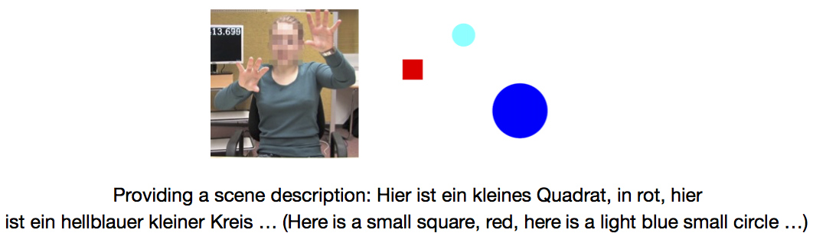

When describing spatial scenes not in the situated environment, humans often describe the scenes with natural language, at the same time complement the verbal descriptions by “placing” the non-visible landmarks in gesture space. To decode such multimodal descriptions, one must interpret speech and gestures in parallel, fuse information from both modalities and build a mental representation of the description.  We provide a data set to model the decoding task. The data set provides audio and video recordings of natural scene descriptions, hand motion data tracked by a [Leap sensor](https://www.leapmotion.com/),  as well as manual transcriptions of verbal descriptions and annotations of deictic gestures.

## Resource details

  
  

We designed a simplified task to elicit multimodal descriptions. For each description, a scece composed of two circles and a square was shown to the participant on a screen. Participants were instructed to describe the scenes in their own way, as long as mentioning the colour, shape, size and spatial relations of the objects. 

In total, the data set includes recordings from 14 native German speakers. To provide some feedback to the participants and create some impression of interactivity (rather than of making a passive recording), after each description a score was shown on the screen, ostensibly reflecting the degree of understanding of an automated system ( In reality, the score was given by a confederate who had the instruction to reward when all attribute types were mentioned). 

 A detailed description of the resource and a baseline model of real-time understanding of multimodal scene descriptions can be found in [the associated paper](https://www.dsg-bielefeld.de/dsg_wp/).

## Download
The original spatial scenes, hand motion data, audio transcriptions and deictic gesture annotations can be downloaded [here](https://pub.uni-bielefeld.de/data/2913177). 

This [Github repository](https://github.com/TINGH/multimodal-spatial-description) contains an instruction of how to use the data.

When using the data in published research, please cite: T. Han and D. Schlangen, A Corpus of Multimodal Spatial Scene Descriptions. Bielefeld University, 2017. doi:10.4119/unibi/2913177.

For audio and video recordings, please write to Ting Han or Prof. David Schlangen. Email: **firstname.lastname[AT]uni-bielefeld.de**.

## Related publications
1. **A Corpus of Natural Multimodal Spatial Scene Descriptions**.  <u>**Ting Han**</u> and David Schlangen. *The 11th edition of the Language Resources and Evaluation Conference (LREC)*, 7-12 May 2018, Miyazaki, Japan. [Accepted] [PUB](https://pub.uni-bielefeld.de/publication/2915806)

1. **Placing Objects in Gesture Space: Toward Real-Time Understanding of Spatial Descriptions** <u>Ting Han</u>, Casey Kennington and David Schlangen.  *The thrity-second AAAI conference on artificial intelligence (AAAI18), Feburary 2-7, New Orleans, Louisiana, USA, 2018*.  [Accepted] [PUB](https://pub.uni-bielefeld.de/publication/2914935)

## Contact
For information, please write to ting.han[AT]uni-bielefeld.de.

## Contributors
The following people have contributed to the data collection:

  - Ting Han, [Dialogue Systems Group, Bielefeld University](http://www.dsg-bielefeld.de/dsg_wp/)
  - David Schlangen, [Dialogue Systems Group, Bielefeld University](http://www.dsg-bielefeld.de/dsg_wp/)
